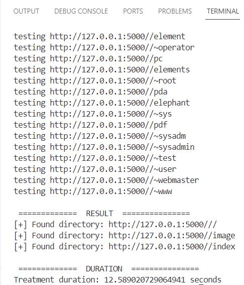

# Directory Brute Forcing Script
A Python script used to brute-forcing a specific url with a wordlist in order to find a traversal vulnerability.

/!\ For educational purposes, do not use without authorisation.

## Author

- FullName : RANDRIAMANJATO Judicaël Voninahitrin'ny Avo Elise
- Email: hei.judicael@gmail.com
- STD: STD21021

## Overview

This Python script iterates through a list of directory or file names, typically referred to as a wordlist, and sends HTTP requests to a server for each entry in the list. When the server responds with specific HTTP status codes (200, 403, or 500), it signifies that the directory or file exists and is accessible. This process effectively identifies existing directories or files on the server.

## How to use it

### Dependencies

The script will work on python3. This script requires the `requests`, `argparse`, `threading` and `time` library, which is used respectively to: send HTTP requests to the server, get the parameters on the CLI, use multithreading and record the duration of treatment.

## How to Test the Code

To test the script, follow these steps:

1. Ensure you have Python installed on your system. If not, you can download it from [python.org](https://www.python.org/).
   
2. Ensure all dependecies as mentionned are ready for use.

3. Run the script with the following command:

```python
python treatment.py http://example.com wordlist.txt
```
Replace `http://example.com` with the URL of the server you want to test against, and `wordlist.txt` with the filename of your wordlist.

In my case: I ran the pathtrav server and use it to test the code:

```python
python .\treatment.py http://127.0.0.1:5000/ .\dir_list.txt
```

4. When processing is complete, it prints a list of the directories found, along with the processing time, as shown in the screenshot below.

